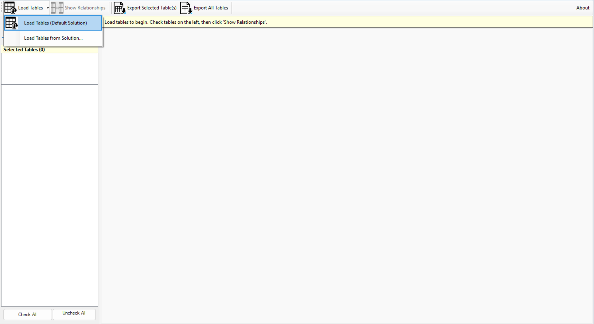

# Relationship Documentor for XrmToolBox

A powerful XrmToolBox plugin for documenting and exporting Microsoft Dynamics 365 / Dataverse entity relationships with solution-aware filtering and Excel export capabilities.

## 🌟 Features

### Multi-Table Selection
- Select multiple tables simultaneously for comparison
- Persistent selection state across filter operations
- "Selected Tables" panel shows all checked tables
- Filter tables by display name or logical name

### Solution-Aware Filtering
- Load tables from default solution or specific solution
- Solution picker dialog for easy selection
- Relationship filtering based on solution components
- Remembers last selected solution

### Comprehensive Relationship Documentation
- **1:N Relationships** - One-to-Many with full cascade behaviors
- **N:1 Relationships** - Many-to-One with referential constraints
- **N:N Relationships** - Many-to-Many with intersect entities
- Complete metadata including Delete, Assign, Share, Unshare, Reparent, and Rollup View configurations

### Excel Export with Sanitization
- Export selected tables or all tables
- Automatic sheet name sanitization (handles invalid characters)
- Smart truncation for names exceeding Excel's 31-character limit
- Display Name (logical_name) format for clarity
- One tab per table with all relationship types combined
- Professional formatting with proper column headers

### User Experience
- Nested tab structure for easy navigation
- Real-time filtering without losing selections
- About dialog with developer contact information
- Comprehensive error logging to XrmToolBox logs
- Settings persistence across sessions

## 📥 Installation

### Via XrmToolBox Plugin Store (Recommended)
1. Open XrmToolBox
2. Click "Tool Library" or "Plugins Store"
3. Search for "Relationship Documentor"
4. Click "Install"

### Manual Installation
1. Download the latest release from [Releases](../../releases)
2. Extract `Relationship.Documentor.dll`
3. Copy to `%AppData%\MscrmTools\XrmToolBox\Plugins\`
4. Restart XrmToolBox

## 🚀 Usage

### Basic Workflow
1. **Connect** to your Dynamics 365 environment
2. **Load Tables** - Choose default solution or specific solution
3. **Select Tables** - Check the tables you want to document
4. **Show Relationships** - Click to load relationship data
5. **Export** - Export selected tables or all tables to Excel

### Tips
- Use the **filter box** to quickly find tables
- **Check multiple tables** to compare relationships side-by-side
- The **Selected Tables panel** shows what's currently selected
- Use **"Check All"** or **"Uncheck All Selected"** for bulk operations
- Export creates one Excel sheet per table with all relationships combined

## 📊 Export Format

### Excel Structure
Each table generates one sheet with the following columns:
- **Relationship Type** (1:N, N:1, or N:N)
- **Relationship Name** (Schema name)
- **Related Table** (Target entity)
- **Attribute** (Lookup/Referencing attribute)
- **Cascade Behaviors** (Delete, Assign, Share, Unshare, Reparent, Merge, Rollup View)
- **Is Customizable**
- **Is Managed**

### Sheet Names
- Format: `Display Name (logical_name)`
- Automatically truncated if > 31 characters
- Invalid characters replaced with underscore
- Example: `Account (account)`, `Sales Order (salesorder)`

## 🛠️ Technical Details

### Requirements
- XrmToolBox 1.2023.12.68 or later
- .NET Framework 4.6.2 or later
- Microsoft Office / Excel (for export viewing)

### Dependencies
- Microsoft.CrmSdk.CoreAssemblies (9.0.2.56)
- Microsoft.Office.Interop.Excel

### Logging
All operations are logged to XrmToolBox log files:
- Location: `%AppData%\MscrmTools\XrmToolBox\Logs\`
- Levels: Info, Warning, Error
- Full exception stack traces for debugging

## 🐛 Known Issues

None currently. Please report issues on the [Issues](../../issues) page.

## 📝 Changelog

See [CHANGELOG.md](CHANGELOG.md) for version history.

## 👨‍💻 Author

**Kamaldeep Singh**
- Website: [kamaldeepsingh.com](https://kamaldeepsingh.com)
- Email: hello@kamaldeepsingh.com
- LinkedIn: [linkedin.com/in/kamaldeepsingh](https://linkedin.com/in/kamaldeepsingh)

## 📄 License

This project is licensed under the MIT License - see the [LICENSE](LICENSE) file for details.

## 🙏 Acknowledgments

- Built with [XrmToolBox](https://www.xrmtoolbox.com/)
- Thanks to the Dynamics 365 community for feedback and support

## 🤝 Contributing

Contributions, issues, and feature requests are welcome!
Feel free to check the [issues page](../../issues).

---

**⭐ If you find this tool helpful, please star the repository!**